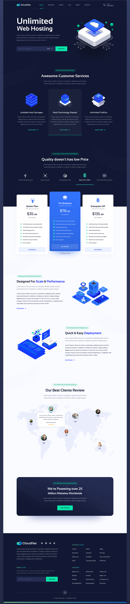

# Cloudflex

Cloudflex es una página web de servicios de alojamiento web. La plataforma ofrece una variedad de soluciones de alojamiento que se adaptan a las necesidades de diferentes clientes, desde pequeñas empresas hasta grandes corporaciones. Los servicios incluyen almacenamiento escalable, tecnología PaaS, tráfico ilimitado, y servidores de alto rendimiento para garantizar que los sitios web de nuestros clientes funcionen de manera eficiente y segura.

## Características

- **Alojamiento web ilimitado**: Ancho de banda ilimitado y servicios robustos para una experiencia web fluida.
- **Soporte al cliente**: Atención personalizada para resolver problemas y guiar a los clientes en el uso de la plataforma.
- **Almacenamiento escalable**: Soluciones que se ajustan al crecimiento del negocio, permitiendo una capacidad de almacenamiento flexible.
- **Tráfico ilimitado**: Todos los planes incluyen tráfico ilimitado para manejar un gran volumen de visitantes sin afectar el rendimiento.
- **Tecnología PaaS**: Facilita el desarrollo, despliegue y gestión de aplicaciones para una experiencia optimizada.
- **Muchas características mas.

## Prototipo

A continuación, se muestra un prototipo visual del diseño de la página:

## Proyecto

Este proyecto fue desarrollado como parte de mis prácticas en la empresa, con el objetivo de mejorar mis habilidades y formación profesional en desarrollo web. La página está diseñada para simular una oferta de servicios de alojamiento web modernos y escalables, con un enfoque en el rendimiento y la satisfacción del cliente.

## Visualizar el Proyecto

Visita la página web desplegada en GitHub Pages para ver el resultado final: [Cloudflex](https://jairoecc.github.io/cloudflex/)

## Tecnologías Utilizadas

- HTML5 y CSS3 para la estructura y el diseño.
- JavaScript para la funcionalidad y las interacciones dinámicas.
- Font Awesome para los iconos y elementos visuales.
- GitHub Pages para la implementación y despliegue de la página.

## Contacto

Para más información o consultas, visita nuestro sitio web o contáctanos a través de nuestras redes sociales.
